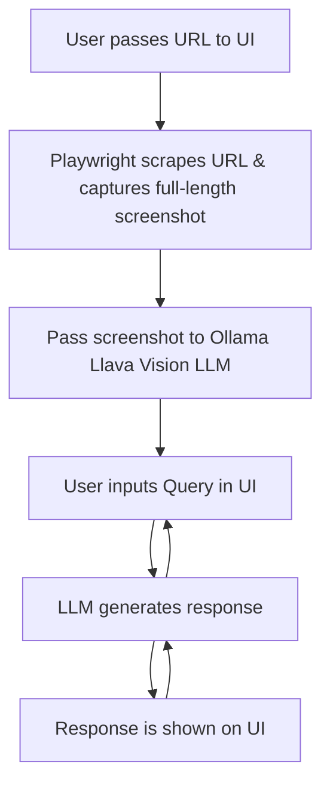
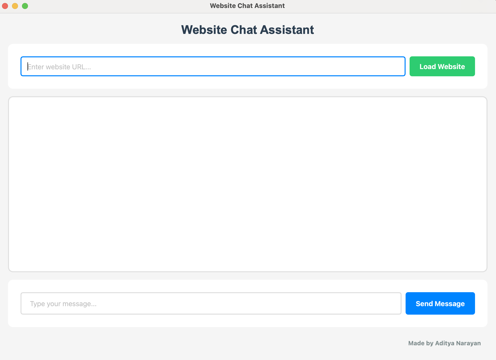
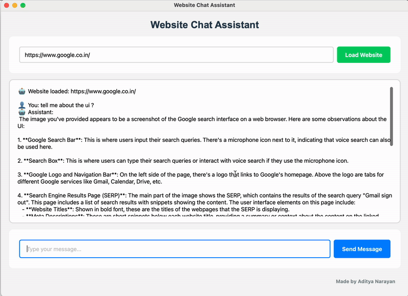

# Website Chat Assistant 🤖

A desktop application that allows you to chat with any website using AI vision capabilities. The assistant can analyze website screenshots and respond to your questions about the content.

## Features ✨

- Load any website URL and capture a full-page screenshot
- Chat interface with AI-powered responses
- Visual analysis of website content using LLaVa model
- Modern and user-friendly GUI built with PySide6

## Flowchart 📊




## Prerequisites 📋

Before running the application, make sure you have:

- ```Python 3.10```
- ```Ollama``` ([more details](https://ollama.com/)) installed with ```LLaVa model``` ([model details](https://ollama.com/library/llava))
- ```Playwright``` browser automation tool
- ```PySide6``` GUI framework

## Installation 🛠️

1. Clone the repository:

```bash
git clone https://github.com/AdityaNarayan001/Web_URL_UI_chatBot.git
cd Web_URL_UI_chatBot
```

2. Install dependencies:

```bash
pip install -r requirements.txt
```
or
```bash
pip3 install -r requirements.txt
```

3. Run the application:

```bash
python main.py
```
or
```bash
python3 main.py
```

## Screenshots 📸





## Usage 📝

1. Enter the URL of the website you want to chat with
2. Click the "Load Website" button to capture a full-page screenshot
3. Type your message in the chat input and press Enter to send
4. The assistant will respond with an AI-generated answer   